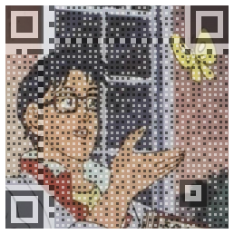
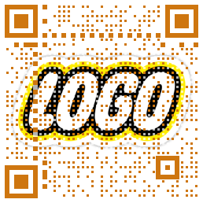

# Q-Art-Codes [](https://www.jsdelivr.com/package/npm/qart-codes) [](https://www.npmjs.com/package/qart-codes)
My own "fancy" browser-and-server-side QR Code generator.

This is built in pure JavaScript, so it should run anywhere. A bundle has also been provided for browser use.

[

](./res/example.html)

## Installation:
Simply run `npm i qart-codes`

## Use guide:

### NodeJS:
```js
const qr = require('qart-codes');

qr.makeQR(
	`{"lastName":"ever","firstName":"greatest","employeeID":1337,"online":true}`, // Data to encode - string or binary array.
	"C:\\CompanyLogo.png" // The background image to use.
).then(async canv => {
	console.log('Built image.');
	await canv.encodeCanvas(fs.createWriteStream('out.png')); // Save the generated PNG bitmap to a file.
}).catch(console.error)
```

### Browser:
```html
<!-- Download this locally or pin the version in production, the code at this link can change: -->
<script src="https://cdn.jsdelivr.net/npm/qart-codes/bundle/browser.js"></script> 
<script>
	qartCode.makeQR(
		`https://shadowmoo.se`,
		"https://i.imgur.com/7tMdIX9.png",
		{
			colors: {
				dark: 'rgba(37,45,206, 1.0)',
				light: 'white'
			}
		}
	).then(async canv => {
		const uri = await canv.encodeCanvas('image/png', 0.95); // The browser encodes to Object URIs.
		const img = new Image();
		img.src = uri;
		document.body.appendChild(img);
	})
</script>
```


## Full Generator Options:
This config is the same in the browser and server.
Here are all the options, with sample values:
```js
const opts = {
    qrOpts: {
        version: 2,  // You may pin the QR version used here, no lower than 2.
        errorCorrectionLevel: 'H'  // See https://www.npmjs.com/package/qrcode#error-correction-level
    },
    size: {
        boxSize: 6,  // The base size, in px, that each square should take in the grid.
        scale: 0.35  // Scale the "small" boxes down to this ratio.
    },
    colors: {
        dark: 'black',  // The color to use for the dark squares.
        light: 'white', // The color to use for the light squares.
        overlay: 'rgba(0,0,0,0.7)'  // If set, cover the background image in a color - this can be used to increase readability.
    },
    useSVG: false  // See "Encoding SVGs".
}
```

## Platform Differences:
For the most part, the code runs the same in the browser and in Node.
However, due to limitations in each environment, the output Canvas object's `encodeCanvas` method behaves differently
with binary image data.

+ In the Browser, the canvas `encodeCanvas('image/png', 0.95)` accepts an image mimetype, and a quality level. 
  + It returns an `URL.createObjectURL` string, which can be used to create images in the DOM.

+ In Node, the canvas `encodeCanvas(stream)` accepts an output stream, which it writes binary PNG image data to.
  + There is no return value for this call, as it is assumed Node will be sending or saving this image.


## Encoding SVGs:
SVG output is tentatively supported in the Browser & Node as of version 2.0.0. 

When `useSVG` is enabled, the output Canvas `encodecanvas()` will always return raw SVG text, no matter the platform running the code.
Additionally, the given background image MUST be a pre-loaded string, containing a background SVG text.

You may have to do some manual formatting of your input background SVG, if you want things to look a specific way.
The encoder tries to fix some of the more common issues, but it is not able to fix everything automatically.
